# Networking

## Switching

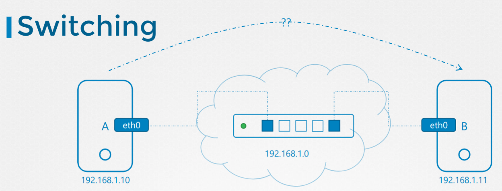

Node A
```
ip link
ip addr add 192.1j68.1.10/24 dev eth0
```

Node B
```
ip link
ip addr add 192.1j68.1.11/24 dev eth0
```

Ping Result
```
node-a $ ping 192.168.1.11
Reply from 192.168.1.11: bytes=32 time=4ms TTL=117
Reply from 192.168.1.11: bytes=32 time=4ms TTL=117
```

## Routing

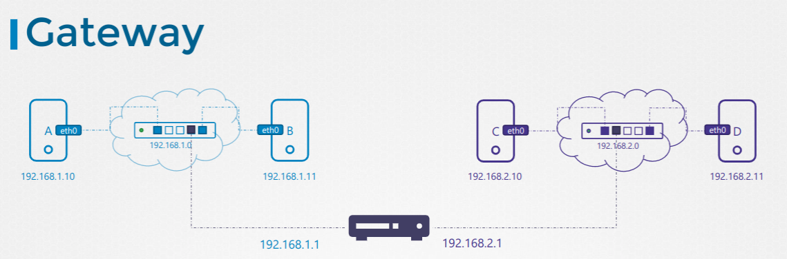

## Gateway

```
ip route add 192.168.1.0/24 via 192.168.2.1
```

## Default Gateway

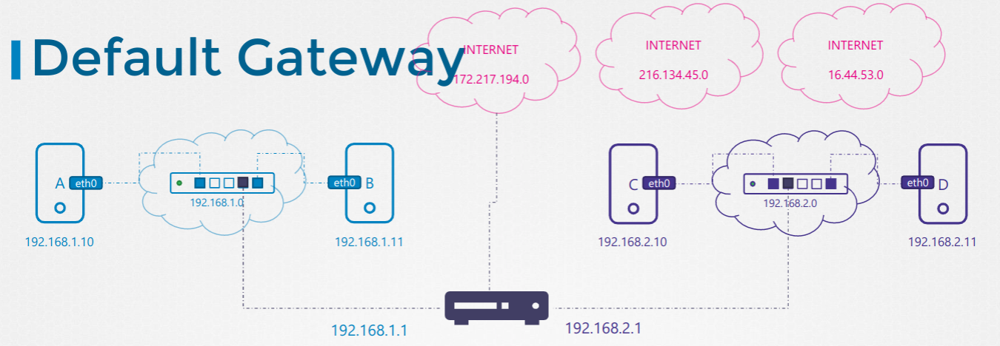

```
ip route add 192.168.1.0/24 via 192.168.2.1
ip route add default via 192.168.2.1
ip route
```

## Routing between nodes

```
cat /proc/sys/net/ipv4/ip_forward
0
echo 1 > /proc/sys/net/ipv4/ip_forward

vim /etc/sysctl.conf
...
net.ipv4.ip_forward = 1
...

node-a $ ping 192.168.2.5
Reply from 192.168.2.5: bytes=32 time=4ms TTL=117
Reply from 192.168.2.5: bytes=32 time=4ms TTL=117
```

## DNS

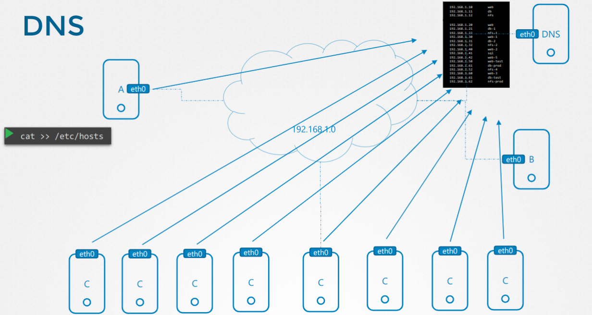

```
cat /etc/resolv.conf
nameserver 192.168.1.100
search cluter.local svc.cluster.local ns-test.svc.cluster.local
```

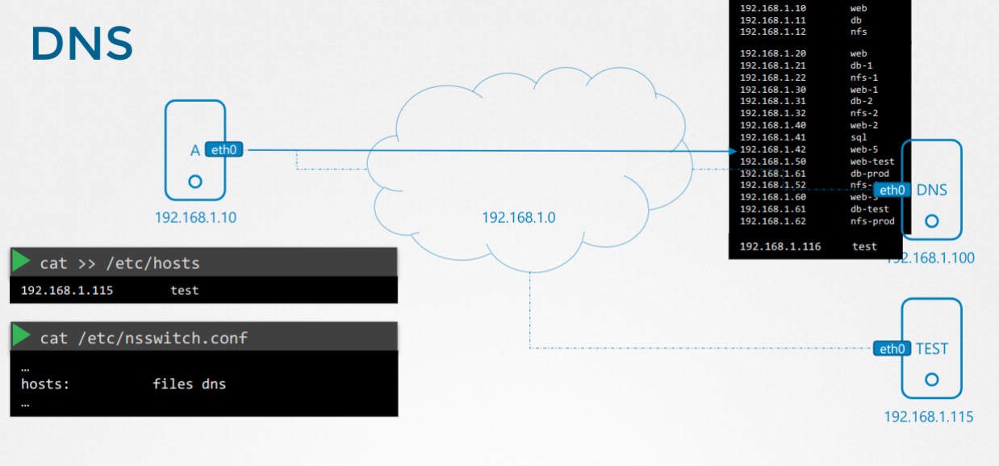


```
cat /etc/nsswitch.conf
...
hosts: files dns
```

## Domain Names

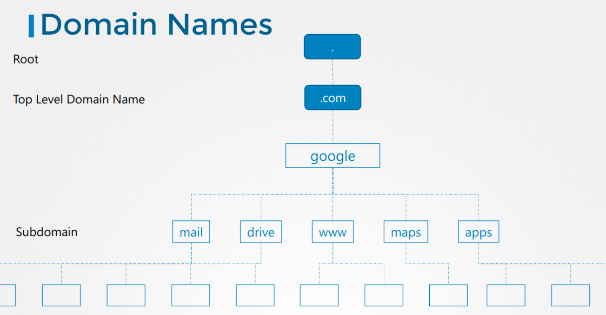

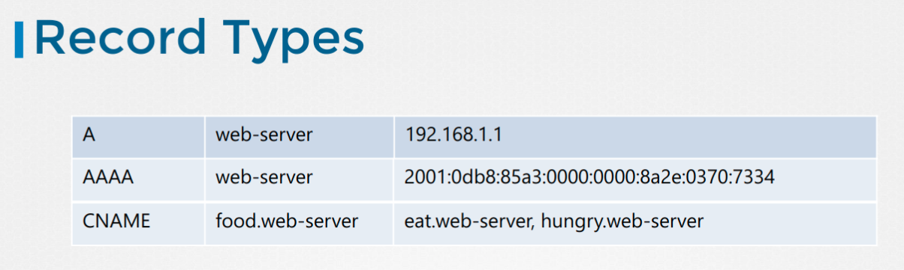

## CoreDNS

```
wget https://github.com/coredns/coredns/releases/download/v1.4.0/coredns_1.4.0_linux_amd64.tgz
tar xvzf coredns_1.4.0_linux_amd64.tgz
```

```
cat /etc/hosts
192.168.1.10    web
192.168.1.11    db

192.168.1.12    web-1
192.168.1.13    db-1

192.168.1.14    web-2
192.168.1.15    db-2
```

```
cat > Corefile
. {
    hosts /etc/hosts
}
```

Run CoreDNS
```
./coredns
```

## NAT Network Address Translator

* Forwarding without NAT

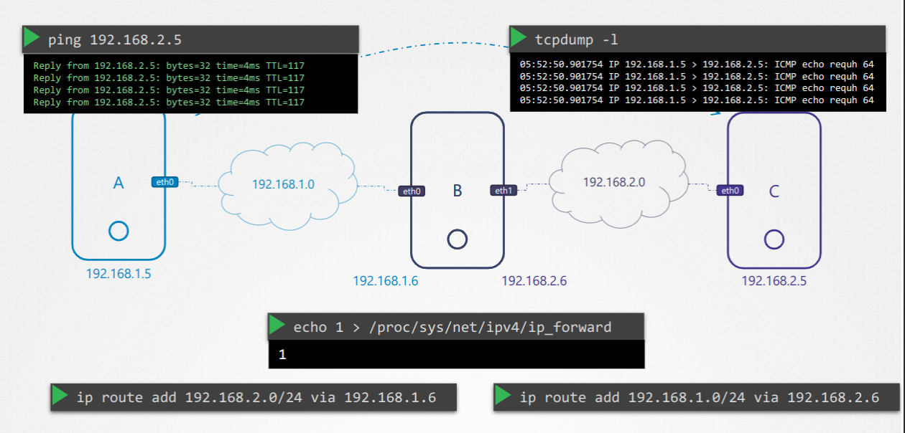

* Forwarding with NAT

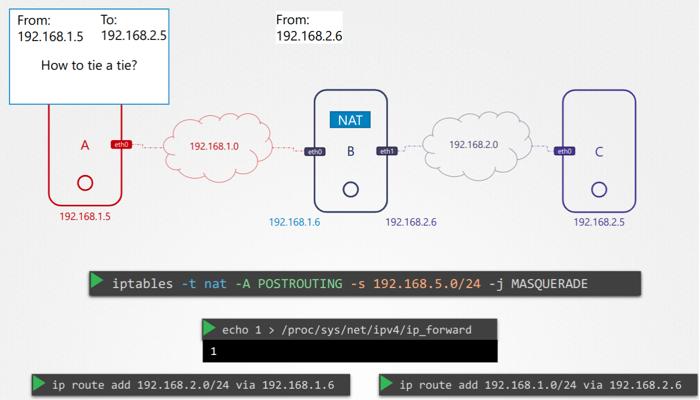

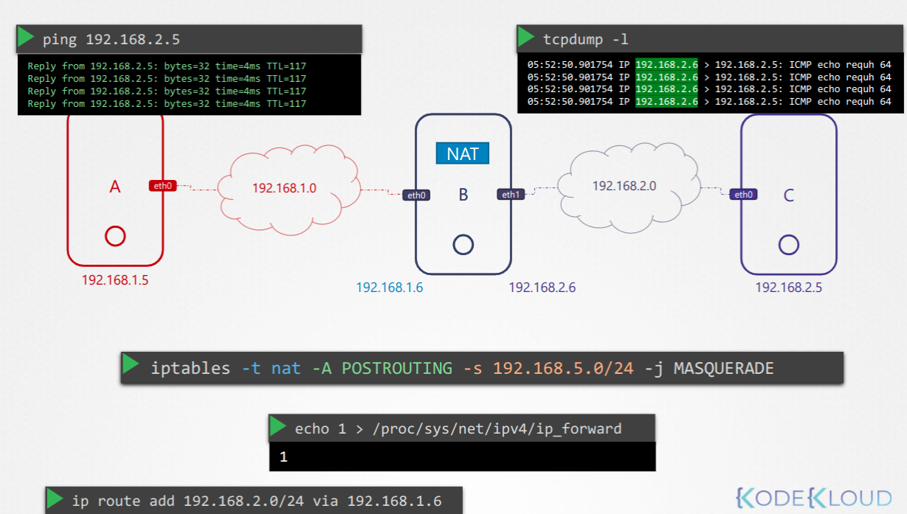

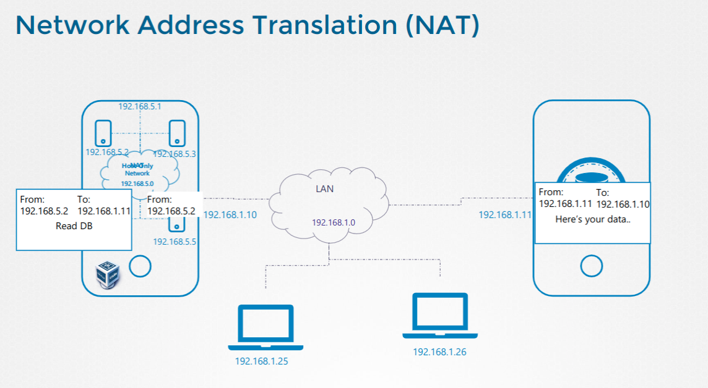

## Bridge

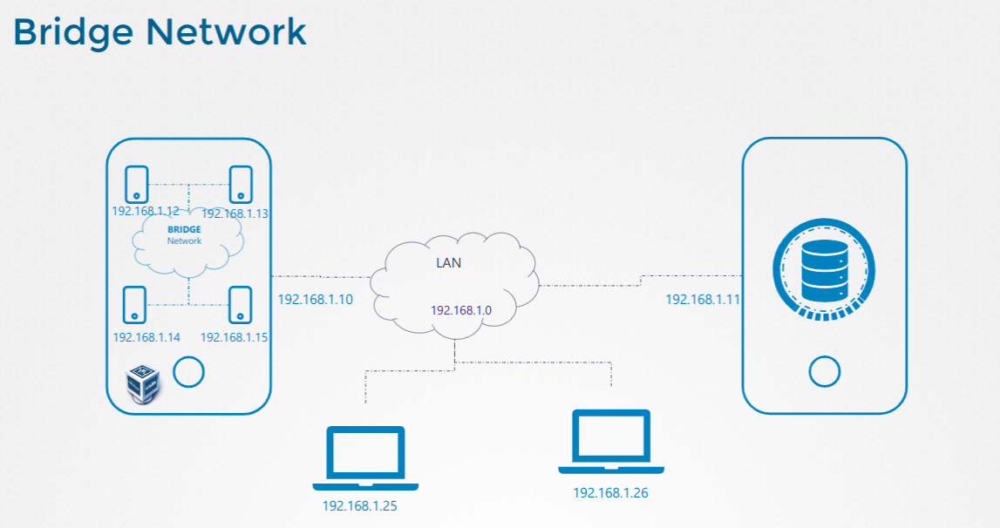

## Namespaces (Linux)

```
ip netns add red
ip netns add blue

ip netns
red
blue

ip link
ip link exec red
ip -n red link

arp
ip netns exec red arp

ip link add veth-red type veth peer name veth-blue
ip link set veth-red netns red
ip link set veth-blue netns blue

ip -n red addr add 192.168.15.1 dev veth-red
ip -n blue addr add 192.168.15.2 dev veth-blue

ip -n red link set veth-red up
ip -n blue link set veth-blue up

ip netns exec red ping 192.168.15.2

ip netns exec red arp
ip netns exec blue arp

arp
``` 

## OVS / LinuxBridge

Create bridge 
```
ip link add v-net-0 type bridge
ip link
ip link set dev v-net-0 up

ip -n red link del veth-red
```


Cable to namespace to bridge
```
ip link add veth-red type veth peer name veth-red-br
ip link add veth-blue type veth peer name veth-blue-br
```

Set interface to bridge master
```
ip link set veth-red netns red
ip link set veth-red-br master v-net-0

ip link set veth-blue netns blue
ip link set veth-blue-br master v-net-0
```

Configure ip address to interface in namespaces
```
ip -n red addr add 192.168.15.1 dev veth-red
ip -n blue addr add 192.168.15.2 dev veth-blue

ip -n red link set veth-red up
ip -n blue link set veth-blue up
```

Test ping
```
ping 192.168.15.1
Not reachable!

ip addr add 192.168.15.5/24 dev v-net-0

ping 192.168.15.1
Reachable!
```

Traffic outside to the namespaces, where 192.168.1.3 is a host outside the namespaces.
```
ip netns exec blue ping 192.168.1.3
ip netns exec blue route

#.5 bridge
ip netns exec blue ip route add 192.168.1.0/24 via 192.168.15.5

ip netns exec blue ping 192.168.1.3
Not reachable!
```

Add iptables rule to masquerade traffic
```
iptables -t nat -A POSTROUTING -s 192.168.15.0/24 -j MASQUERADE

ip netns exec blue ping 192.168.1.3
Reachable!
```

Traffic to Internet
```
ping 8.8.8.8
Not Reachable!

ip netns blue ip route add default via 192.168.15.5

ping 8.8.8.8
Reachable!!
```

Traffic from outside 192.168.1.3 to 192.168.15.2
```
external-node $ ping 192.168.1.3
Not Reachable!

iptables -t nat -A PREROUTING --dport 80 --to-destination 192.168.15.2:80 -J DNAT

external-node $ ping 192.168.1.3
Reachable!
```

## Docker Networking

Don't traffic
```
docker run --network none nginx-1
docker run --network none nginx-2
```

Host traffic, physical host ip 192.168.1.10
```
docker run --network host nginx

curl http://192.168.1.10
200!
```

Docker bridge, docker daemon create a bridge where the container connect a virtual interface and the bridge has another virtual interces.

```
docker run nginx

docker network ls
docker inspect <network id>
```

## Docker Network Deep Dive

More information about docker network [here](https://docs.docker.com/network/network-tutorial-standalone/)

```
ip link add docker0 type bridge

docker network ls
ip link
ip netns
docker inspect <network_id>
```

Portforward
```
iptables \
    -t nat \
    -A PREROUTING \
    -J DNAT \
    --dport 8080 \
    --to-destination 80
```

```
sudo iptables -nvL -t nat 
...
Chain DOCKER (2 references)
 pkts bytes target     prot opt in     out     source               destination         
    0     0 RETURN     all  --  br-afe55aa78f57 *       0.0.0.0/0            0.0.0.0/0           
    0     0 RETURN     all  --  docker0 *       0.0.0.0/0            0.0.0.0/0           
    1    40 DNAT       tcp  --  !docker0 *       0.0.0.0/0            0.0.0.0/0            tcp dpt:443 to:172.17.0.2:443
    0     0 DNAT       tcp  --  !docker0 *       0.0.0.0/0            0.0.0.0/0            tcp dpt:80 to:172.17.0.2:80
``` 

## Container Network Interfaces (CNI)

- [Deploy Addons](https://kubernetes.io/docs/concepts/cluster-administration/addons/)
- [Addons](https://kubernetes.io/docs/concepts/cluster-administration/networking/#how-to-implement-the-kubernetes-networking-model)
- [Install Weave](https://kubernetes.io/docs/setup/production-environment/tools/kubeadm/high-availability/#steps-for-the-first-control-plane-node)

## CNI - Weaveworks

Check CNI

```
$ ps -ef | grep kubelet | grep cni
oot      4563  3.9  4.6 1782948 94992 ?       Ssl  22:00   0:03 /usr/bin/kubelet --bootstrap-kubeconfig=/etc/kubernetes/bootstrap-kubelet.conf --kubeconfig=/etc/kubernetes/kubelet.conf --config=/var/lib/kubelet/config.yaml --cgroup-driver=systemd --network-plugin=cni --pod-infra-container-image=k8s.gcr.io/pause:3.1 --cni-bin-dir=/opt/cni/bin

plugin=cni

kubectl get pods -A

ll /opt/cni/bin
cat /etc/cni/net.d/10-weave.conflist
```

Deploy CNI
```
kubectl apply -f "https://cloud.weave.works/k8s/net?k8s-version=$(kubectl version | base64 | tr -d '\n')"
```

## Services

Check proxy mode. Possibility adding like argument in kube-proxy (view slides). By default `iptables`

```
controlplane $ kubectl logs  kube-proxy-v2smv -n kube-system
I1220 23:45:20.463750       1 node.go:136] Successfully retrieved node IP: 172.17.0.42
I1220 23:45:20.463884       1 server_others.go:111] kube-proxy node IP is an IPv4 address (172.17.0.42), assume IPv4 operation
W1220 23:45:20.743038       1 server_others.go:579] Unknown proxy mode "", assuming iptables proxy
...
```

## DNS

Services
```
<service_name>.<namespace_name>.svc.cluster.local

kubernetes.default.svc.cluster.local
```

PODS
```
<ip with dash>.<namespace_name>.pod.cluster.local

10-244-2-5.default.pod.cluster.local
```

## CoreDNS

CoreDNS deploy with deployment or daemonSet

```json
cat /etc/coredns/Corefile
.:53 {
    errors
    health
    kubernetes cluster.local in-addr.arpa ip6.arpa {
        pods insecure
        upstream
        fallthrough in-addr.arpa ip6.arpa
    }
    prometheus :9153
    proxy . /etc/resolv.conf
    cache 30
    reload
}
```

```
kuebectl get service -n kube-system
```


```
kubectl get deploy

kubectl get svc -n kubectl

ip .10

kubectl describe deploy coredns -n kube-system | grep Args -A2
```

## Ingress

```yaml
apiVersion: extensions/v1beta1
kind: Ingress
metadata:
  annotations:
    nginx.ingress.kubernetes.io/rewrite-target: /
    nginx.ingress.kubernetes.io/ssl-redirect: "false"
  name: ingress-wear-watch
  namespace: app-space
spec:
  rules:
  - http:
      paths:
      - backend:
          serviceName: wear-service
          servicePort: 8080
        path: /wear
        pathType: ImplementationSpecific
      - backend:
          serviceName: video-service
          servicePort: 8080
        path: /stream
        pathType: ImplementationSpecific
      - backend:
          serviceName: food-service
          servicePort: 8080
        path: /eat
        pathType: ImplementationSpecific
```

```yaml
controlplane $ cat /var/answers/ingress-pay.yaml
apiVersion: extensions/v1beta1
kind: Ingress
metadata:
  name: test-ingress
  namespace: critical-space
  annotations:
    nginx.ingress.kubernetes.io/rewrite-target: /
spec:
  rules:
  - http:
      paths:
      - path: /pay
        backend:
          serviceName: pay-service
          servicePort: 8282
controlplane $
```


Deploy IngressController

```yaml
kubectl create namespace ingress-space
kubectl create configmap nginx-configuration -n ingress-space
kubectl create serviceaccount ingress-serviceaccount -n ingress-space

---
apiVersion: apps/v1
kind: Deployment
metadata:
  name: ingress-controller
  namespace: ingress-space
spec:
  replicas: 1
  selector:
    matchLabels:
      name: nginx-ingress
  template:
    metadata:
      labels:
        name: nginx-ingress
    spec:
      serviceAccountName: ingress-serviceaccount
      containers:
        - name: nginx-ingress-controller
          image: quay.io/kubernetes-ingress-controller/nginx-ingress-controller:0.21.0
          args:
            - /nginx-ingress-controller
            - --configmap=$(POD_NAMESPACE)/nginx-configuration
            - --default-backend-service=app-space/default-http-backend
          env:
            - name: POD_NAME
              valueFrom:
                fieldRef:
                  fieldPath: metadata.name
            - name: POD_NAMESPACE
              valueFrom:
                fieldRef:
                  fieldPath: metadata.namespace
          ports:
            - name: http
              containerPort: 80
            - name: https
              containerPort: 443
---
apiVersion: v1
kind: Service
metadata:
  name: ingress
  namespace: ingress-space
spec:
  type: NodePort
  ports:
  - port: 80
    targetPort: 80
    protocol: TCP
    nodePort: 30080
    name: http
  - port: 443
    targetPort: 443
    protocol: TCP
    name: https
  selector:
    name: nginx-ingress
---
apiVersion: extensions/v1beta1
kind: Ingress
metadata:
  name: ingress-wear-watch
  namespace: app-space
  annotations:
    nginx.ingress.kubernetes.io/rewrite-target: /
    nginx.ingress.kubernetes.io/ssl-redirect: "false"
spec:
  rules:
  - http:
      paths:
      - path: /wear
        backend:
          serviceName: wear-service
          servicePort: 8080
      - path: /watch
        backend:
          serviceName: video-service
          servicePort: 8080
---
apiVersion: v1
kind: Namespace
metadata:
  name: ingress-space
spec:
---
apiVersion: v1
kind: ServiceAccount
metadata:
  name: ingress-serviceaccount
  namespace: ingress-space
---
apiVersion: v1
kind: ConfigMap
metadata:
  name: nginx-configuration
  namespace: ingress-space
---
apiVersion: rbac.authorization.k8s.io/v1
kind: Role
metadata:
  labels:
    app.kubernetes.io/name: ingress-nginx
    app.kubernetes.io/part-of: ingress-nginx
  name: ingress-role
  namespace: ingress-space
rules:
- apiGroups:
  - ""
  resources:
  - configmaps
  - pods
  - secrets
  - namespaces
  verbs:
  - get
- apiGroups:
  - ""
  resourceNames:
  - ingress-controller-leader-nginx
  resources:
  - configmaps
  verbs:
  - get
  - update
- apiGroups:
  - ""
  resources:
  - configmaps
  verbs:
  - create
- apiGroups:
  - ""
  resources:
  - endpoints
  verbs:
  - get
---
apiVersion: rbac.authorization.k8s.io/v1
kind: RoleBinding
metadata:
  labels:
    app.kubernetes.io/name: ingress-nginx
    app.kubernetes.io/part-of: ingress-nginx
  name: ingress-role-binding
  namespace: ingress-space
roleRef:
  apiGroup: rbac.authorization.k8s.io
  kind: Role
  name: ingress-role
subjects:
- kind: ServiceAccount
  name: ingress-serviceaccount
```


